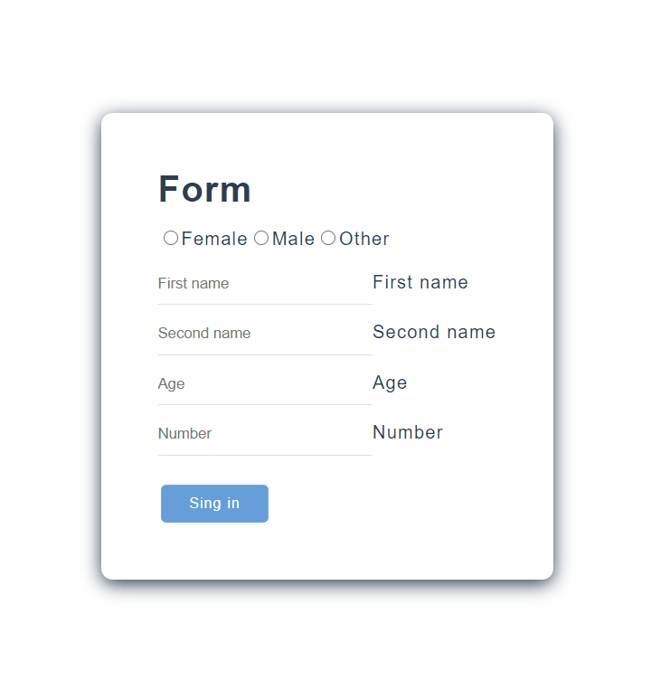

# Форма с валидацией на Vue.js

## Выполнено [Клюкановой Дианой](https://github.com/alexmasterblack) и [Уткиным Данилом](https://github.com/DanilKlukanov)
## Б8119-01.03.02систпро

## [Deploy on Heroku](https://validate-form-vue.herokuapp.com/)
